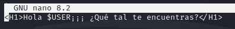
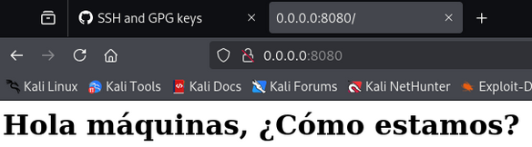

# PPS-Actividad4Unidad0-JulioManuelTatoPulido
## Configuración inicial
* Configuramos el editor de comandos, y utilizaremos el comando nano.

~~~
git config --global core.editor nano
~~~

* Configuramos también cuando utilicemos ``git dif``.

~~~
git config --global core.pager ' '
~~~

* Comprobamos que valor tienen las variables de configuración de git.

~~~
git config --help`
~~~

* Ajustamos los valores de las variables de Git:

## Creamos el proyecto y el repositorio

~~~
echo "# PPS-Actividad4Unidad0-JulioManuelTatoPulido" >> README.md
git init
git add README.md
git commit -m "first commit"
git branch -M main
git remote add origin git@github.com:jmtatop01 PPS-Actividad4Unidad0-JulioManuelTatoPulido.git
git push -u origin main
~~~

## Creamos una configuración para ignorar archivos

* Hemos creado una carpeta con nombre "Excluido", donde vamos a colocar la documentación que no queremos que se vea ni sea subida al repositorio.

* En donde hemos creado un archivo vacío en ella, y uno en la carpeta principal.

* A continuación, hemos creado un archivo con nombre ".gitignore" el cuál hemos configurado para que no se vean los archivos de la carpeta Excluido.

* Después, hemos comprobado con un ``git status`` que se ha ignorado la carpeta Excluido y su interior:

## Trabajo con Git

* He creado un archivo llamado "index.html", al cuál se le ha introducido una frase en html:

* Y luego, he visualizado el estado del proyecto con ``git status``:

* También lo hemos subido a mi repositorio de github:

## Creación de servidor web y de visualización del proyecto

* Hemos ejecutado el comando ``php -S 0:8080``, para poder visualizar la página html en mi navegador.

## Seguimos trabajando con Git

* Hacemos una copia de "index.html" con el nombre "index.html.save" utilizando el comando.

~~~
cp index.html index.hmtl.save
~~~

* Cambiamos el texto de "index.hmtl" con el comando ``nano index.html``, y comprobando el resultado en la página web.

* Después restauramos la versión anterior del archivo con el comando ``git restore index.html`` y volviendo a comprabarlo en la web:

* A continuación, se nos pide que lo subamos al repositorio con el comando ``git push`` y que lo cambiemos en el GitHub.

* Una vez cambiado, se nos pide hacer el comando ``git pull`` y comprobar que se ha cambiado correctamente otra vez en la página web:

## Ramas

* Hemos creado una rama llamada Vers1, donde se nos pide que subamos el archivo "index.hmtl" modificado, para que sean diferentes los archivos de las diferentes ramas.

